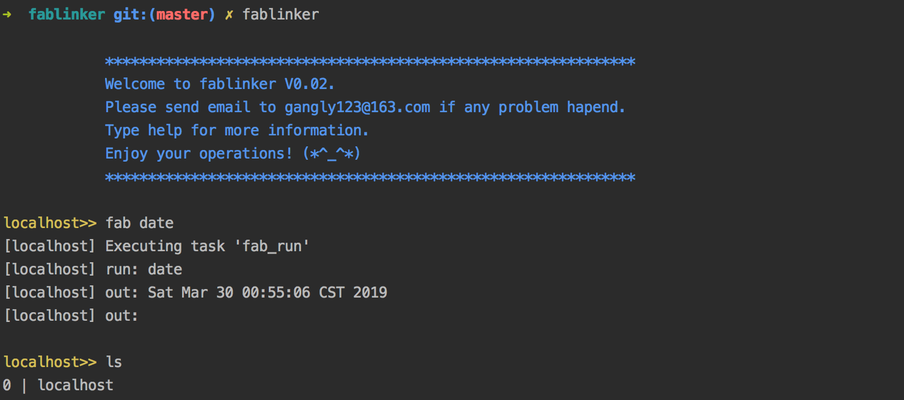
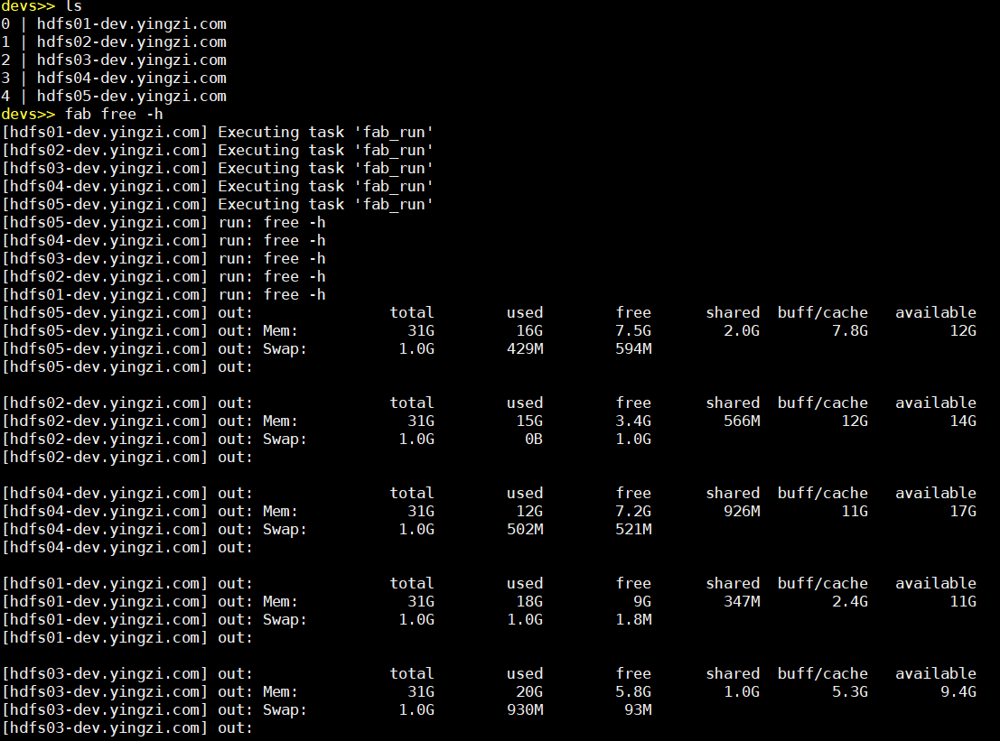

# fablinker
## 1.fablinker是什么
fablinker是一个类似ansible开源自动化运维工具，在一台服务器上可管理控制多个远程主机。

基于fabric开发，兼容python2.7、python3+。
相对ansible和fabric，fablinker基于命令行交互式操作，使用起来更加方便快捷。

使用前首先需要确保所有机器能用ssh连接。具体使用请查看应用场景章节。
文档同步更新在github, https://github.com/gangly/fablinker
<div align=center>
</div>

## 2.fablinker有哪些功能

**在远程多机器执行命令**
* put : 从本地主机上分发文件至所有远程主机
* get : 从远程主机上收集文件至本地主机，将远程主机文件都搜集到本机并将文件重命名，带上主机名，-n参数，将远程文件名加上数字
* at: 切换到某个单机，或者切换到某个机器组
* addgrp: 动态机器分组
* fab shellcmd : 在所有远程主机上执行shellcmd命令， 比如 ls, php test.php, kill, ps等
* fab vim test.txt : 依次打开所有远程主机上的test.txt文件，可写入，更改， 保存。
* !cmd   可以在本地执行命令

其中cmd.txt文件中一行一个命令

**工具特点**
* 采用命令行交互式
* 所有命令的使用方法都可以通过输入help命令来查看
* 返回结果有警告和错误的会以不同颜色标识
* 所有的更改配置的操作，当程序退出时会自动保存到配置文件中
* 需要在远程主机后台执行命令只需要加上&，比如 fab nohup python hello.py &

## 3. 安装和使用

### 安装

**方法1.下载源码安装**

下载源码压缩包，解压后在目录中运行：
```bash
python setup.py install
```
**方法2.pip安装**
```bash
pip install fablinker
```
上面两种方法都会在当前用户的home目录下创建一个.fablinker目录，并在目录里创建默认配置文件fabconf.ini

具体路径为~/.fablinker/fabconf.ini

###  修改配置文件

可以到~/.fablinker修改默认配置文件fabconf.ini。
直接在命令行执行fablinker，将使用默认配置文件

如果需要使用其他配置文件，可以自己创建一个文件，并在运行命令时指定该配置文件路径
```bash
fablinker -f  myconf.ini
```

下面是一份简单的配置文件示例，
 
```
[baseconf]
user = work
password = **
parallel = False
[host_groups]
Group0 = [192.168.181.132, 192.168.181.133, 192.168.181.134]

spider = [192.168.181.132, 192.168.181.137, 192.168.181.134, 192.168.181.139]
```
baseconf选项是一些基本配置

user：可用ssh登录其他机器的用户名，

password ：登录密码，没有密码为空

parallel ：多个远程主机是否并行运行命令 , 当然在用fab命令的时候可以加参数动态更改并行选项。注意fab vim 命令不能并行执行，将直接导致错误！

host_groups配置主机分组，可将用于不同项目的主机分组管理。主机间用逗号分隔。

这里创建了Group0，和spider组，可以用at命令切换到不同组，操作不同的远程主机。


**批量执行命令：将要执行的命令放入一个文件中**

## 4. 应用场景
[具体应用场景举例](https://github.com/gangly/fablinker/blob/master/doc/应用场景.md)

## 5. 命令详解

[命令详解](https://github.com/gangly/fablinker/blob/master/doc/命令详解.md)

fab date 运行试试，会有惊喜！



在每台机器运行Free命令



_____

**给作者点个star或请作者喝杯咖啡**

<div align=left>
</div>
